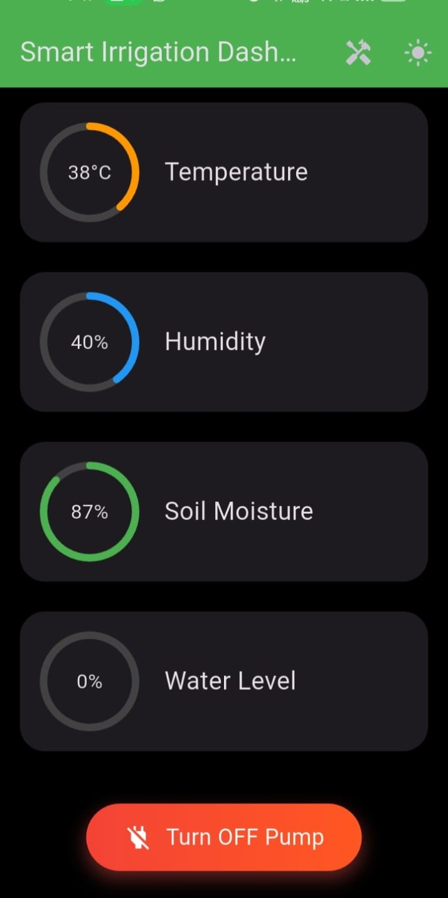
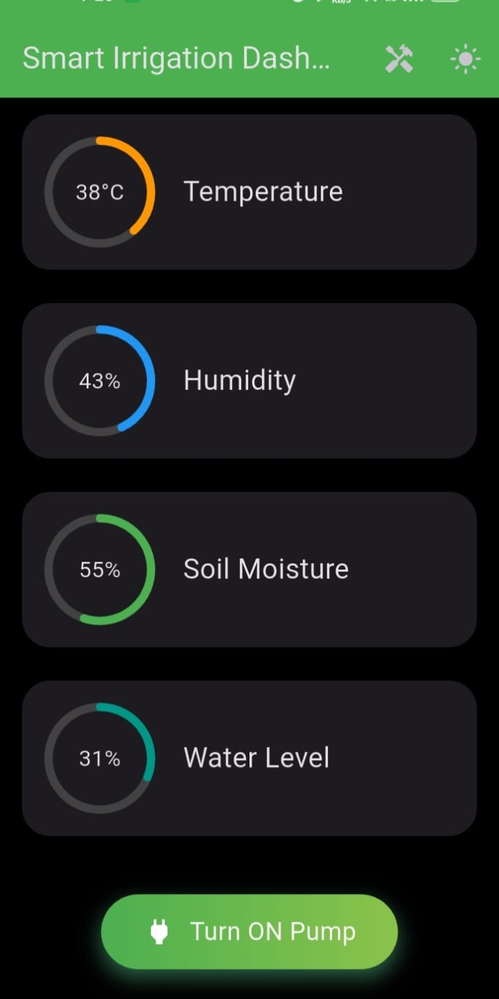
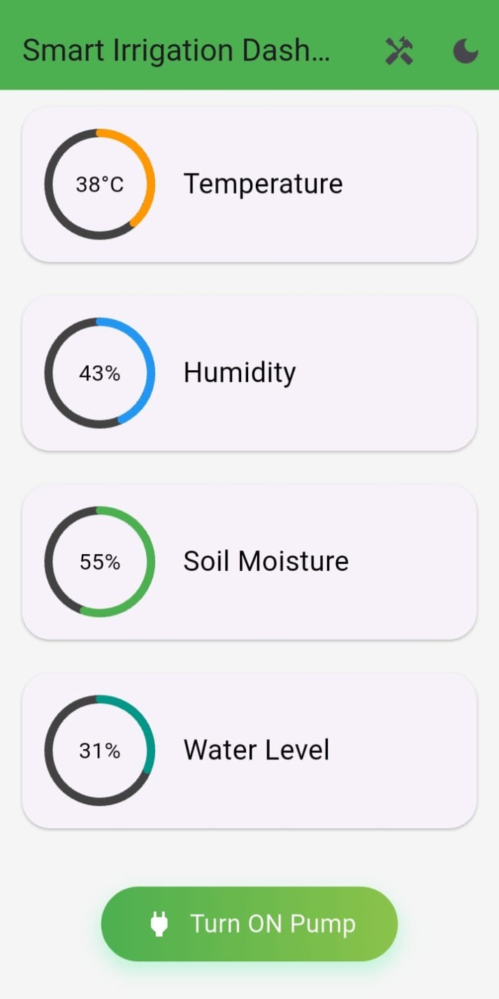

# 🌱 Smart Irrigation IoT System

An IoT-based intelligent irrigation system that monitors environmental conditions in real-time and automates water management using ESP32, sensors, Firebase, and a Flutter mobile application.

## 🚀 Project Overview

Water scarcity and inefficient irrigation are major agricultural challenges. This project implements a smart irrigation system that:

- Monitors soil moisture
- Tracks temperature and humidity
- Checks water tank level
- Automatically controls water pump
- Sends real-time data to a mobile app

The system integrates hardware sensors with cloud-based data storage and a user-friendly Flutter dashboard.

## 🛠️ Technologies Used

### Hardware
- ESP32
- DHT11 (Temperature & Humidity Sensor)
- Soil Moisture Sensor
- Water Level Sensor
- Relay Module (Pump Control)
- I2C LCD Display

### Software
- Arduino IDE
- Firebase Realtime Database
- Flutter (Mobile App)
- REST API Integration

---

## ⚙️ System Architecture

1. Sensors collect environmental data.
2. ESP32 processes data.
3. Data is sent to Firebase in real-time.
4. Flutter app fetches and displays live data.
5. Pump is controlled automatically or manually via app.

---

## 📱 Mobile Application Features

- Live sensor readings
- Pump ON/OFF control
- Threshold configuration
- Real-time Firebase sync
- Clean dashboard UI

---

### Screenshots

### Dashboard

### Sensor Data

### Pump Control

---

## 🎯 Key Features

- Real-time IoT monitoring
- Cloud integration
- Automated irrigation logic
- Mobile-first control system
- Low-cost hardware implementation

---
## 🌍 Impact

This system promotes efficient water usage and sustainable agriculture by automating irrigation based on real environmental data.

---

## 👩‍💻 Author

**Andleeb Razzaq**  
AI & Flutter Developer  
Focused on intelligent IoT systems and smart automation solutions

